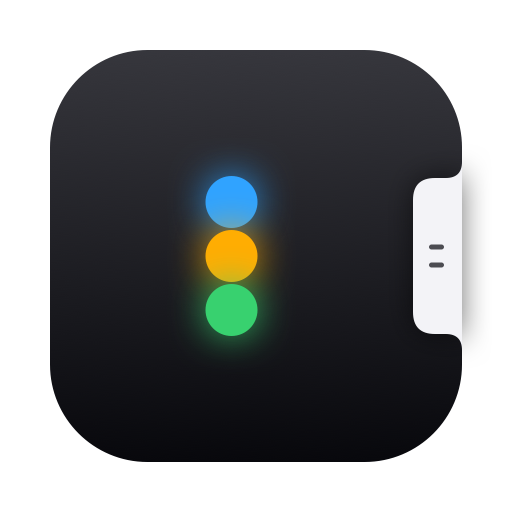
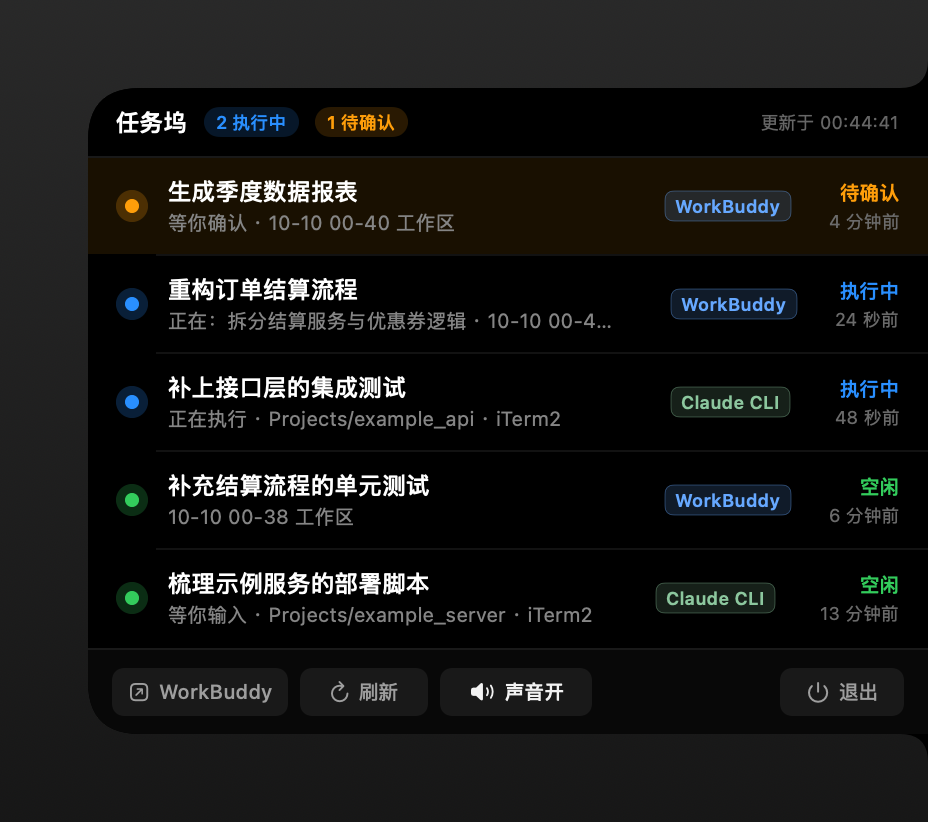
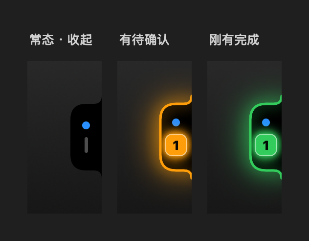
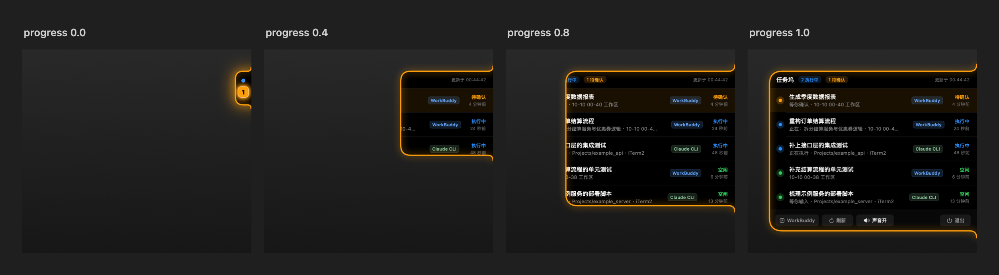

<p align="center">
  
</p>

<h1 align="center">任务坞 · NotchTasks</h1>

<p align="center">
  屏幕右边缘的一枚把手，鼠标扫过去就向左展开——<br>
  把 <b>WorkBuddy</b> 与<b>终端里的 Claude Code CLI</b> 的任务状态收在一处。
</p>

<p align="center">
  <a href="https://github.com/smarty-kiki/notch_tasks/actions/workflows/ci.yml"></a>
  <a href="https://github.com/smarty-kiki/notch_tasks/releases/latest"></a>
  
  
  <a href="LICENSE"></a>
</p>

<p align="center">
  
</p>

---

## 它是什么

一个常驻 macOS 的**无窗口应用**：屏幕右边缘靠上贴着一枚黑色把手，鼠标扫过去面板向左展开，
列出最近的任务；没有任务需要你操心的时候，它就安静地待在那儿。

它解决的是一个很具体的问题：**同时在跑的东西太多了**。WorkBuddy 里有几个会话在干活、
终端里还开着几个 Claude Code CLI，到底哪个跑完了、哪个卡在等你确认，不去逐个切换窗口是不知道的。

- **该你出手的时候会吵你**——任务停下来等你确认 / 授权时，把手亮起脉冲描边 + 光晕 + 角标，
  可选地响一声、发一条系统通知
- **扫一眼就知道**——列表按状态排好序，颜色一眼分辨「在跑 / 等你 / 完事了」，
  刚结束的尤其醒目
- **点一下就回去**——点 WorkBuddy 的任务切回 WorkBuddy，点 CLI 的任务切到 iTerm2
- **只读**——只看状态，不碰你的数据、不改你的任何文件
- **零依赖**——8 个 `.swift` 文件直接 `swiftc` 编出来，没有 SPM / CocoaPods 依赖

<p align="center">
  
  <br>
  <sub>把手的三种形态 —— 常态（有任务在跑）· 有待确认 · 刚有完成</sub>
</p>

## 安装

**下载现成的**：到 [Releases](https://github.com/smarty-kiki/notch_tasks/releases/latest) 下载
`NotchTasks-<版本>-macos-universal.dmg`，打开后把 `NotchTasks.app` 拖进「应用程序」。

不想用 dmg 的可以下 `.zip`，解压即用。两个包旁边都有 `.sha256` 可以校验：

```bash
shasum -a 256 -c NotchTasks-1.0.0-macos-universal.dmg.sha256
```

| 要求 | |
|---|---|
| 系统 | macOS 14 (Sonoma) 或更高 |
| 架构 | Apple Silicon 与 Intel 通用（`arm64` + `x86_64`） |

产物是 **ad-hoc 签名**（没有 Apple Developer ID），所以首次打开会被 Gatekeeper 拦下。
这不是坏了——**右键点图标 →「打开」**一次即可，之后正常双击：

```bash
# 或者用命令去掉隔离标记
xattr -dr com.apple.quarantine /Applications/NotchTasks.app
```

**自己编**：只要装了 Xcode 或 Command Line Tools 就行，不需要别的依赖。

```bash
git clone https://github.com/smarty-kiki/notch_tasks.git
cd notch_tasks
./run.sh                 # 编译并启动
```

## 使用

| 操作 | 效果 |
|---|---|
| 鼠标扫到把手 | 展开面板 |
| 鼠标移开约 0.5 秒 | 开始收起（倒计时从离开那一刻起算，中途回到面板上会撤销） |
| 点任务行 | 回它的老家：`WorkBuddy` 标签 → 切回 WorkBuddy；`Claude CLI` 标签 → 切到 iTerm2 |
| 面板底栏 | 打开 WorkBuddy / 立即刷新 / 声音开关 / 退出 |
| **菜单栏图标** | 显示·收起面板、立即刷新、声音提醒、系统通知、显示已完成、显示条数（**最多** 4 / 6 / 8 条）、显示屏幕（多屏时）、打开 WorkBuddy、退出 |

把手的位置固定贴在屏幕**右边缘**、距顶 204pt——比菜单栏低一截，不会挡到菜单栏图标，也不容易压住别的窗口右上角。

## 状态语义

两个数据源各自的字段含义并不一致，所以它们被映射到**同一套**语义上；
列表上按**颜色**区分，不用去猜词：

| 状态 | 颜色 | 含义 | WorkBuddy 侧 | Claude Code CLI 侧 |
|---|---|---|---|---|
| **待确认** | 橙 | 等你确认 / 授权 / 有未读结果 | `status = 'pending'`、`unread != 0`、自动化 `read_at IS NULL` | `status = 'waiting'` |
| **执行中** | 蓝 | 正在干活 | `status = 'working'` | `status = 'busy'` |
| **空闲** | 明亮绿 | 没事干，或者**刚刚结束** | 任务结束不超过 10 分钟 | `status = 'idle'`（进程还活着） |
| **已完成** | 灰蓝 | 早就结束了 | `status = 'completed'`，且结束已超过 10 分钟 | — |
| **失败** | 红 | 失败 / 中断 | `status in ('error','terminated')` | — |

排序就按这个顺序：**待确认 → 执行中 → 空闲 → 失败 → 已完成**。

### 「刚完成」和「早就完成」

结束是**同一个状态**，只有时间差——所以只按时间分两个视觉档位
（`TaskItem.recentDoneWindow`，默认 10 分钟；再久就从列表里移走）：

| 结束距今 | 显示 | 为什么 |
|---|---|---|
| ≤ 10 分钟 | 空闲 · **明亮绿** | 还「热」，值得你看一眼 |
| 10 ~ 20 分钟 | 已完成 · **灰蓝** | 安静下来，不要再抢注意力 |
| > 20 分钟 | **不显示** | 列表是「现在在发生什么」，不是历史记录 |

这样视线焦点天然落在"刚有动静的东西"上，而昨天跑完的任务不会一直杵在那里发光。

> 两个窗口是独立的常量：`TaskItem.recentDoneWindow`（10 分钟，决定何时从绿变灰）
> 和 `TaskStore.finishedWindow`（20 分钟，决定何时移出列表）。
> **待确认的任务不受时间限制** —— 要是被时间清掉，提醒就等于丢了。

> CLI 会话的 `idle` 会一直显示成绿色——进程还活着，随时可以接着用；
> 而 WorkBuddy 的任务结束了就是结束了，所以会随着时间从绿沉到灰。

完整映射表可以离线打出来核对，冒烟测试也在断言它：

```bash
./build/NotchTasks --states
```

## 数据来源（**全程只读**）

| 来源 | 读到什么 |
|---|---|
| `~/.workbuddy/workbuddy.db` → `sessions` | 会话任务：标题、状态、工作目录、最后活动时间、未读 |
| `~/.workbuddy/workbuddy.db` → `automation_runs` | 自动化运行，`read_at IS NULL` = 待确认 |
| `~/.workbuddy/tasks/<sessionId>/*.json` | 当前 `in_progress` 子任务，显示成「正在：…」 |
| `~/.claude/sessions/<pid>.json` | 终端里 Claude Code CLI 的会话与执行状态 |
| `~/.claude/projects/<cwd>/<sessionId>.jsonl` | 会话记录里的 `ai-title`——即 Claude 给终端标签起的标题 |

**零写入保证**：程序从不打开原库。每一轮把 `workbuddy.db` / `-wal` / `-shm`
复制到系统临时目录 `notchtasks-snapshot/`，只在副本上查询，并加 `PRAGMA query_only = ON`。
副本会做一次 `SELECT count(*)` 校验，读取到撕裂的数据就丢弃重读。

两个数据源都不存在时（没装 WorkBuddy、没跑过 Claude Code）也不会崩，面板只显示空状态。

> **CLI 会话的发现是「注册表 ∪ 最近在动的记录」**，不能只看注册表：
> `~/.claude/sessions/<pid>.json` 会漏 —— 被程序 spawn 出来的 claude（比如数字员工
> 平台起的）照样写会话记录、照样在干活，却不写这个文件（实测：同一时刻创建的两个会话，
> 一个注册了、一个没有，跟「按日清理」无关）。
> 所以反过来也以**会话记录**为准：谁的文件最近还在动，谁就在跑（15 分钟窗口），
> 状态从记录尾部推断，两个信号：
> **停在 `AskUserQuestion` / `ExitPlanMode` 这类「必须由用户回应」的工具上**
> → 「待确认」；否则**只有最后一条消息 `stop_reason == end_turn` 才算「空闲」**
> （助手明确答完、在等你），其余一律当在跑。
> 注意不能反过来写成「`tool_use` 才是在跑」：工具执行完写下的是一条
> `user`(`tool_result`)，那条没有 `stop_reason`，而此刻助手马上就要接着干活。
> 注册表里有的仍用 Claude 自己写的 `status`，更准。

<details>
<summary>CLI 那边的 <code>status</code> 是怎么读的</summary>

`~/.claude/sessions/<pid>.json`——**文件名就是 PID**，里面自带状态字段：

```json
{"pid":44187,"sessionId":"…","cwd":"…/example_api","name":"example-api-ef",
 "status":"busy","updatedAt":1790944083343}
```

- `status` 已知取值：`busy`（干活）/ `idle`（停在提示符等你输入）/
  `waiting`（**停在等你确认或授权**，此时多一个 `waitingFor` 字段，如 `"permission prompt"`）
- 未知取值一律按「运行中」处理，原始英文只写进 `NOTCHTASKS_DEBUG` 日志，不显示到界面上
- 存活判断：`kill(pid, 0)` **加上** `proc_pidpath` 校验可执行文件路径里含 `claude`——
  只看 PID 会被系统复用骗到，出现早就退出的"幽灵会话"
- 时间取「`updatedAt` 字段」与「文件 mtime」里更晚的那个

**列表里的标题来自会话记录，不是注册表。** 注册表里那个 `name`（如 `kiki-2d`）
是派生的，跟终端标签对不上；Claude 真正起的标题写在
`projects/<cwd 转义>/<sessionId>.jsonl` 的 `{"type":"ai-title","aiTitle":"…"}` 记录里，
会随会话推进反复重写。所以从记录**尾部**往前找最近的一条（只读尾部 256 KB，
按 mtime + size 缓存，不必反复解析几十 MB 的记录）；会话刚开始还没标题时，
退回用注册表里的派生名。

> 顺带一个容易误判的现象：`~/.claude/sessions/` 会被 Claude Code 自己**按日清理**
> （见 `~/.claude/.last-cleanup`）。清理后那一刻目录是空的，
> App 自然一条 CLI 会话也列不出来，直到下一个会话注册进来。这是数据源的正常行为，
> 不是 App 读不到。
>
> **另一个会让会话凭空消失的原因**：这个注册表文件会被 Claude Code 以「内容变短但不截断」
> 的方式重写，旧内容更长时尾部会留下上一次的残片（实测见过
> `{…完整对象…}51,"waitingFor":"permission prompt"}` 这种）。整文件严格解析遇到 extra data
> 会直接失败，会话就静默没了。所以读取时改成括号配对、**只取第一个完整对象**，
> 并在读到写入中途的半截内容时沿用上一轮的值，避免列表闪断。

</details>

## 常见问题

**列表里一个 Claude Code CLI 会话都没有？**
大概率是本来就没会话在跑。`./build/NotchTasks --claude` 能把几种情况分开：
进程真的退了、`sessions/` 被按日清理过（清完那一刻是空的）、注册表文件被写坏过、
或者会话压根没注册（见上面「CLI 会话的发现」—— 这类会从会话记录里补回来）。
都不影响 WorkBuddy 那边的显示。

**打开被拦、提示"无法验证开发者"？**
产物是 ad-hoc 签名，没有 Developer ID。右键点图标 →「打开」，或跑一次上面那条 `xattr` 命令。

**把手挡住鼠标了 / 挡住别的东西了？**
把手只占右边缘靠上的一块 **32×68** 区域（约 y 204–272），平时把鼠标停在别处它会一直保持收起。
但如果你有别的工具也占这块位置，会重叠。窗口层级是 26（高于菜单栏），所以它会浮在所有
Space 和全屏应用之上——这是刻意的，否则切到全屏应用就看不见了。

**需要给什么系统权限吗？**
不需要。悬停靠鼠标位置判断，点击靠自己算命中区域。唯一会弹的是**通知权限**，
不授权也不影响把手本身的提醒（只是不发系统通知）。

**会开机自启动吗？**
不会，没有装任何 LaunchAgent。想要的话在「系统设置 → 通用 → 登录项」里手动加
`NotchTasks.app` 即可。

**点了任务行为什么只切到 iTerm2、没切到具体标签页？**
目前只把 iTerm2 带到前台。要精确切标签得用 AppleScript，会额外弹一次「自动化」授权；
现在还没做。

**会读我的代码或对话内容吗？**
不会。只读上面那张表里的状态字段（标题、状态、目录、时间），不读会话正文、不读代码。

**任务标题被截断了？**
面板 420pt 宽，标题单行截断。工作目录那行会取末两级显示（WorkBuddy 的时间戳工作区
会转成「10-02 22:41 工作区」这种更好读的形式）。

## 实现细节

<details>
<summary><b>把手为什么是「反角」而不是直角贴边</b></summary>

形状的右边缘直接贴住屏幕，在与上、下边交界处用一段**凹曲线（反角）**向上 / 向下翘起、
融进屏幕边缘。看上去是从屏幕边缘"长出来"的，而不是被一刀切断——直角贴边会有被切掉的感觉。
展开态反角半径 14，收起态 8。

</details>

<details>
<summary><b>为什么形状外圈要留 44pt 空白</b></summary>

三个用途：

1. 反角向上 / 下翘起的空间（反角 14 ≤ 44）
2. **告警光晕的完整衰减空间**——`.shadow(radius: 18)` 的可视范围约 38pt，
   留白小于它，光晕就会在窗口边界被硬切出一道不自然的断口。
   实测留白 20pt 时窗口边界处光强还比背景高 0.12，44pt 时降到 0.000
3. 描边自身的光晕（radius 7）

留白大了会白白吞掉点击，所以**空闲且收起时把窗口设成不接收鼠标事件**
（`UIState.updateMouseEventPolicy()`）：留白区域能点到底下的东西；
有告警或已展开时才接收事件。悬停感应区也单独按形状自身的矩形算
（`shapeFrame(expanded:)`），不跟着留白一起变大。

</details>

<details>
<summary><b>收起时面板为什么不会「整个消失」</b></summary>

收起和展开的顺序是反着来的，但同样讲究：**只把 `progress` 放进动画事务**，
`ui.expanded`（决定内容层画面板还是把手）和窗口尺寸都等动画播完才落。

一开始不是这么写的——`collapse()` 一进门就把 `expanded` 翻成 false，
于是内容层瞬间从面板换成把手，屏幕上变成「一块满尺寸的黑色空面板僵在那儿 0.22 秒，
然后啪地收掉」。看着就是卡顿，其实是内容层被提前砍了。

现在面板会留在原地，被越来越小的形状**从左边逐步裁掉**，收完才换成把手——
此时形状已经缩到把手尺寸，两者位置重合，切换无缝。收到一半又把鼠标移回来，
`expand()` 会把 progress 反向播回去，不会卡在半路。

</details>

<details>
<summary><b>展开动画为什么一定从把手那一点长出来</b></summary>

把手和面板是**同一个形状在变形**，锚点直接写在路径计算里
（`MorphPath.path(in:)`），不依赖 SwiftUI 的布局对齐或隐式 frame 插值：
`progress`（0→1）线性插值宽高、圆角与反角半径，形状的右边缘恒定贴住容器右侧。

同一个 `MorphPath` 同时用于**背景填充、内容裁剪、告警描边**，三者几何必然一致，
动画中内容不会溢出还在变小的背景。展开时先把窗口撑到目标尺寸再播动画，
避免生长过程被窗口边界裁掉；收起时等收缩动画播完再缩窗口。

逐帧渲染（`--animframes`）量下来，右边缘全程不动（440 = 画布右边缘 = 屏幕边缘）：

| progress | 形状 x 范围 | y 范围 |
|---|---|---|
| 0.0 | 408…**440** | 14…94 |
| 0.4 | 252…**440** | 12…218 |
| 0.8 | 98…**440** | 10…342 |
| 1.0 | 20…**440** | 10…404 |

<p align="center">
  
</p>

</details>

<details>
<summary><b>为什么点击不用 SwiftUI 的 <code>Button</code> / <code>onTapGesture</code></b></summary>

本 app 是 accessory（无 Dock 图标）且**永远不会成为活跃 app**——前台始终是别的应用。
这种窗口里 SwiftUI 的手势收不到点击，所以行点击和底栏按钮都由控制器自己命中：
`UIState.hitTest(_:rowCount:)` 把面板内坐标映射成 `row(i)` / `footer(i)` / `none`。

投递路径有两条并做去重：窗口的 `mouseDown`（点击直接落到我们窗口时），
以及全局鼠标监听 + 屏幕坐标换算（点击被交给前台 app 时）。
底栏按钮因此是**纯展示**的（`FooterChip`），宽度固定，保证"画在哪"和"命中哪"严格一致。

</details>

<details>
<summary><b>告警描边为什么不闭合</b></summary>

描边走的是不闭合路径：从右上反角贴屏幕的一端起笔 → 顶边 → 左边 → 底边 →
右下反角贴屏幕的一端收笔，**只排除贴着屏幕的那段直边**。

反角要描——光晕顺着凹曲线收进屏幕边缘，是"从边缘长出来"的收口；
右直边不描——一条黄线贴着屏幕边缘闪，纯属劣质。

</details>

没有告警时不加任何投影：形状外圈只画告警色的光晕，黑色投影会让面板外围浮出一圈灰，
在浅色壁纸上很明显。

## 开发

```bash
make help                # 全部命令
./build.sh               # 编译到 dist/NotchTasks.app
./build.sh --universal   # 通用二进制（arm64 + x86_64）
./run.sh                 # 编译并启动
make test                # 冒烟测试
./package.sh             # 打发布包 → dist/NotchTasks-<版本>-macos-universal.dmg + .zip
make screenshots         # 重新生成 docs/ 下的截图（用合成数据，可安全公开）
make icons               # 重新生成 App 图标
make sounds              # 重新生成放大过的提示音 → Resources/Sounds/
```

### 无 GUI 自检

全部不需要屏幕录制权限，也不需要本机装着 WorkBuddy / Claude Code：

```bash
./build/NotchTasks --dump                     # 打印当前读到的任务
./build/NotchTasks --states                   # 状态映射表（逻辑状态 → 展示状态 + 配色）
./build/NotchTasks --hittest 150 90 6         # 面板内坐标 → 命中的行 / 底栏按钮
./build/NotchTasks --preview /tmp/np --demo   # 离屏渲染各状态 PNG（--demo = 合成数据）
./build/NotchTasks --animframes /tmp/an       # 逐帧渲染生长动画，验证锚点
./build/NotchTasks --claude                   # Claude 注册表：原始内容 / 解析结果 / 进程存活
./build/NotchTasks --sound                    # 提示音响度：系统原版 ↔ 自带放大 的 dBFS 对比
```

调试开关：

```bash
NOTCHTASKS_FORCE_ALERT=confirm|done|running|idle ./dist/NotchTasks.app/Contents/MacOS/NotchTasks
NOTCHTASKS_DEBUG=1 ./dist/NotchTasks.app/Contents/MacOS/NotchTasks   # 打印几何 / 命中 / 鼠标策略
```

在**真实窗口**里抓收起过程的帧（一次运行只抓一帧，改 `_AT` 多跑几次拼出时间曲线）：

```bash
for t in 0.02 0.05 0.08 0.11 0.14 0.17 0.20; do
  NOTCHTASKS_COLLAPSEPROBE=/tmp/cp/$t NOTCHTASKS_COLLAPSEPROBE_AT=$t \
    ./dist/NotchTasks.app/Contents/MacOS/NotchTasks
done
```

> 为什么不一次多抓几帧：`cacheDisplay` 是同步渲染整棵视图树，一次就要几十毫秒。
> 在一次 0.22s 的动画里连抓五六帧会把主线程占满，等于自己把动画卡住，
> 抓到的帧张张相同——那样量到的不是动画，是阻塞。

抓**展开**动画的帧：

```bash
NOTCHTASKS_DEBUG=1 NOTCHTASKS_ANIMPROBE=/tmp/live \
  ./dist/NotchTasks.app/Contents/MacOS/NotchTasks
# 输出 /tmp/live/live-*.png，并打印每帧 path(in:) 收到的 rect
```

### 源码结构

```
Sources/
  main.swift        入口：--dump / --states / --hittest / --preview / --animframes
  Models.swift      TaskItem / TaskState / displayState / AlertLevel
  Database.swift    只读 SQLite（快照复制后查询）
  ClaudeStore.swift 终端 Claude Code CLI 会话（只读 ~/.claude/sessions）
  TaskStore.swift   轮询、查询、状态映射与跃迁检测
  NotchUI.swift     UIState / MorphPath / 形状 / 把手 / 面板
  App.swift         窗口控制器、几何与锚点、悬停与点击、通知、菜单栏
  SoundPlayer.swift 提醒音（优先播自带的放大版，退回系统原版）
  Preview.swift     离屏渲染：静态预览 + 逐帧动画
tools/
  make-icon.swift   App 图标生成 → Resources/AppIcon.icns + docs/logo.png
  make-strip.swift  多图横向拼接，用于生成 docs/ 的对比图
  make-sounds.swift 把系统提示音放大后导出到 Resources/Sounds/
scripts/
  smoke-test.sh     冒烟测试（本地和 CI 共用同一份）
  make-screenshots.sh 重新生成 docs/ 下的全部界面图
.github/workflows/
  ci.yml            构建 + 冒烟测试 + 通用二进制
  release.yml       推 v* 标签 → 打包并创建 Release
```

## 参与贡献

欢迎提 issue 和 PR。动手前请看一眼 [CONTRIBUTING.md](CONTRIBUTING.md)——
里面记了几个踩过的坑（生长动画的锚点、光晕留白与点击、为什么不能用 SwiftUI 手势、
两个 `status` 字段的语义），能省不少时间。

## 许可

[MIT](LICENSE) © 2026 Yao Yang

随便用：可以自由使用、修改、商用、闭源分发，不需要事先问我。
**但有一件事必须做**——MIT 的条件是：

> The above copyright notice and this permission notice shall be included in all
> copies or substantial portions of the Software.
> （上述版权声明与本许可声明，必须包含在本软件的所有副本或实质性部分中。）

也就是说，**无论怎么改、怎么分发，都得保留 `LICENSE` 里的版权声明和许可文本**，
不能抹掉作者。为了不让这条在转发途中丢掉，`LICENSE` 也被打进了
`.app/Contents/Resources/`，下载 dmg / zip 的人拿到产物时就带着它。

> 需要说明的是：MIT 只保证「署名」，不保证「衍生作品也开源」。
> 别人改完可以闭源发布，只要保留声明即可。
> 如果你要的是「改了也必须开源」，那得用 GPL-3.0 / AGPL-3.0——但本项目是按 MIT 发布的。
